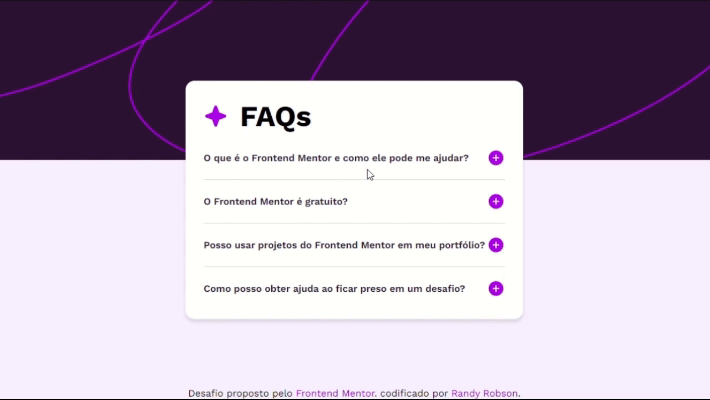

# Solução para o Acordeão de Perguntas (FAQ) - Frontend Mentor

Essa é a minha solução para o [FAQ accordion challenger do Frontend Mentor](https://www.frontendmentor.io/challenges/faq-accordion-wyfFdeBwBz). Os desafios do Frontend Mentor ajudam a melhorar suas habilidades de codificação através da construção de projetos realistas.

## Índice

- [Visão Geral](#visão-geral)
  - [O desafio](#o-desafio)
  - [Imagens](#imagens)
  - [Links](#links)
- [Meu processo](#meu-processo)
  - [Tecnologias usadas](#tecnologias-usadas)
  - [Objetivo](#objetivo)
  - [Materias usados](#materias-usados)

## Visão Geral

### O desafio

O desafio consistia em construir uma página de perguntas frequentes (FAQ). Os usuários devem ser capazes de:

- Ao clicar em uma pergunta, ocultar/mostrar a resposta.
- Naveguar pelas perguntas e ocultar/mostrar as respostas usando apenas a navegação pelo teclado.
- Visualizar o layout ideal da interface independente do tamanho da tela do dispositivo usado.
- Visualizar os estados hover e focus de todos os elementos interativos da página.

### Imagens

### Links

- Veja aqui a página: [FAQ accordion](https://randyrobson.github.io/faq-accordion-frontend-mentor/index.html)

## Meu processo

### Tecnologias usadas

- HTML5 Semântico
- Propriedade CSS personalizadas
- Flexbox
- Grid Layout
- Conceito Mobile-first

### Objetivo

Meu principal objetivo com esse desafio foi aprender e aplicar estruturas de repetições com o JavaScript. Utilizei a estrutura de laço "for" para diminuir e simplificar ao máximo o código final, como também não poluir o código HTML com muitos "Id" e "Class".

### Materias usados

- [Curso em Vídeo](https://www.youtube.com/playlist?list=PLHz_AreHm4dlsK3Nr9GVvXCbpQyHQl1o1) - No curso de JavaScript do Guanabara aprendi os conceitos básicos de uma estrutura de repetição para a construção do código.
- [CFB Cursos](https://www.youtube.com/playlist?list=PLx4x_zx8csUg_AxxbVWHEyAJ6cBdsYc0T) - Com o Bruno do CFB Curso aprendi a usar o operador "this" dentro de funções e a propriedade "nextElementSibling".
- [MDN Web Docs](https://developer.mozilla.org/pt-BR/docs/Web/JavaScript/Guide/Expressions_and_Operators) - Aqui aprendi o uso de operadores lógicos para retorna valores booleanos em um função.

 
